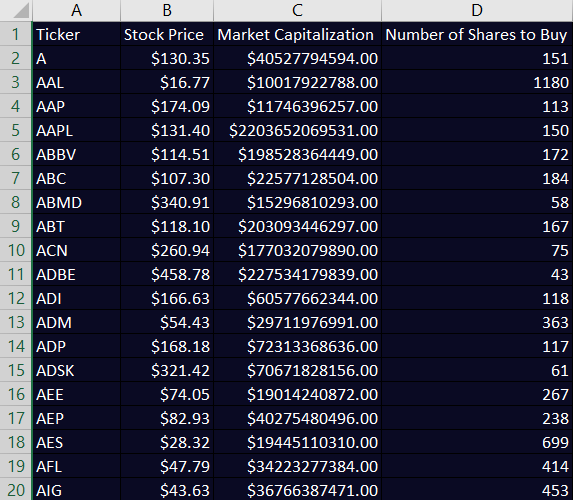

# Algorithmic Trading with IEX CLOUD and Python
The three projects included utilize python for algorithmic trading. I created these projects by following along with developer Nick McCullum's YouTube [Tutorial.](https://www.youtube.com/watch?v=xfzGZB4HhEE&feature=youtu.be) .  The projects come from templates posted to his [repo](https://github.com/nickmccullum/algorithmic-trading-python). I filled in the templates by following along with the course. The three projects consist of an Equal-Weight S&P 500 Index Fund, a Quantitative Momentum Investing strategy and a a Quantitative Momentum Investing Strategy. 

### Building An Equal-Weight S&P 500 Index Fund

The goal of this project was to create an equal-weight version of the S&P 500 index fund. As an input the project takes the value of a portfolio and tells the user how man shares of each stock in the S&P 500 they should buy in order to produce an equal-weight version. As an output this script exports an xml file with the index, as shown below.

### Building A Quantitative Momentum Investing Strategy

This project is a quantitative momentum strategy that determines how many of the top 50 best stocks to buy based on their individual high-quality moment scores, which indicates they have increased in price the most over a certain time frame. Similar to the previous project the output is an xml file which shows how many of each to buy, shown below.

### Building A Quantitative Value Investing Strategy

This project is a quantitative value strategy that decides how many of the top 50 best stocks to buy according to their robust value scores, which indicates how the cost relates to the value of the business.
